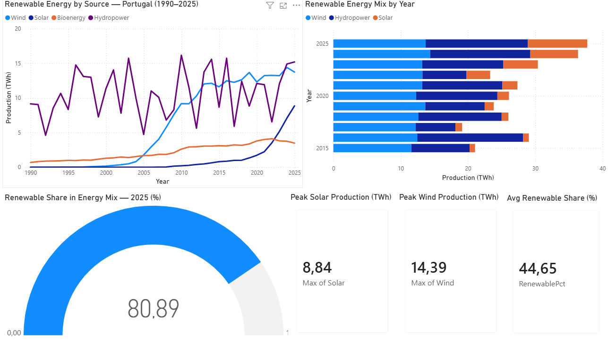
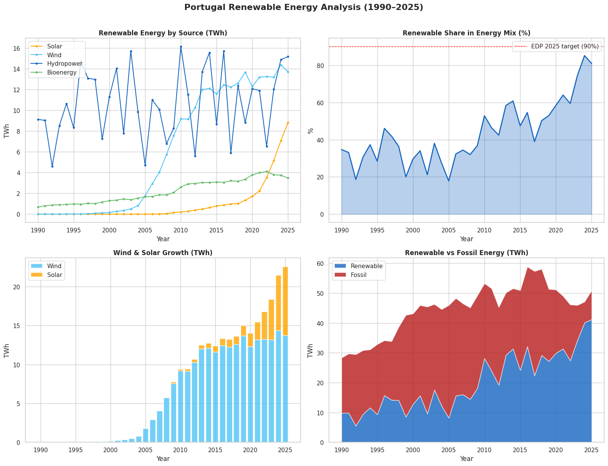

# Portugal Renewable Energy Analysis (1990–2025)

## Project Overview

This project analyses **35 years of Portugal's energy transition** using Python and Power BI, covering the evolution of Solar, Wind, Hydropower and Bioenergy production from 1990 to 2025.

Developed as part of preparation for an **EDP Asset Management** interview, this project demonstrates the ability to work with real energy data, build KPI dashboards, and extract actionable insights relevant to renewable asset management.

---

## Dataset

- **Source:** [Our World in Data — Electricity Production by Source](https://ourworldindata.org/grapher/electricity-prod-source-stacked)
- **Country:** Portugal
- **Period:** 1990 – 2025
- **Variables:** Solar · Wind · Hydropower · Bioenergy · Gas · Oil · Coal

---

## Key Findings

| Metric | Value |
|---|---|
| Renewable share in 2025 | **80.9%** |
| Best renewable year | 2024 (85.1%) |
| Solar growth since 2010 | **+4,110%** |
| Wind growth since 2010 | **+49%** |
| Fossil energy reduction since 2010 | **-61%** |
| Peak solar production | 8.84 TWh |
| Peak wind production | 14.39 TWh |
| EDP target 2030 | 100% renewable |

### Key Insights

- **Solar is the fastest growing source** — from 0.21 TWh in 2010 to 8.84 TWh in 2025, a +4,110% increase driven by falling panel costs and government incentives
- **Wind is the backbone of Portugal's renewable mix** — consistent growth since 2000, now the largest single renewable source
- **Hydropower is volatile** — highly dependent on annual rainfall, creating year-to-year variability in the renewable share
- **Fossil fuels reduced by 61%** since 2010 — from 25.13 TWh to 9.74 TWh, reflecting Portugal's strong decarbonisation trajectory
- **Portugal is on track for EDP's 100% renewable target by 2030** — already at 80.9% in 2025

---

## Tools & Skills


---

## Dashboard (Power BI)



**Dashboard includes:**
- Renewable energy evolution by source (1990–2025)
- Renewable energy mix by year (2015–2025)
- Gauge showing current renewable share (80.9% in 2025)
- KPI cards: Peak Solar, Peak Wind, Avg Renewable Share

---

## Python Analysis



**Analysis includes:**
- Renewable energy by source over time
- Renewable share in energy mix vs EDP 2030 target
- Wind & Solar growth comparison
- Renewable vs Fossil energy stack

---

## Repository Structure

```
📁 portugal-renewable-energy-analysis
├── 📄 README.md
├── 📓 portugal_renewable_energy_analysis.ipynb
├── 📊 portugal_energy_analysis.png
└── 📊 dashboard_page1.png
```

---

## How to Run

1. Clone this repository
2. Download the dataset from [Our World in Data](https://ourworldindata.org/grapher/electricity-prod-source-stacked) — filter for Portugal
3. Open `portugal_renewable_energy_analysis.ipynb` in Google Colab
4. Upload the CSV when prompted and run all cells

---

## Context

This project was developed as part of interview preparation for an **EDP Asset Management** position, demonstrating data analysis skills applied directly to the renewable energy sector.

**Author:** Marius Faur · [LinkedIn](https://linkedin.com/in/mariusfaur) · [GitHub](https://github.com/mariussfaur)
